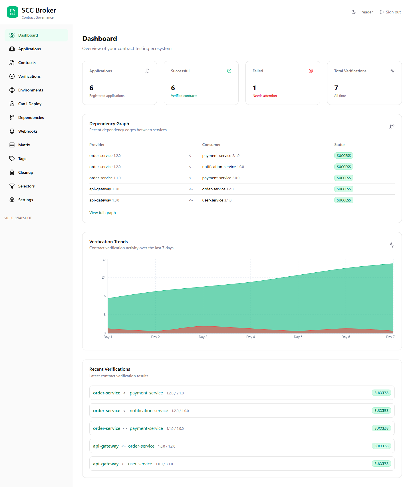
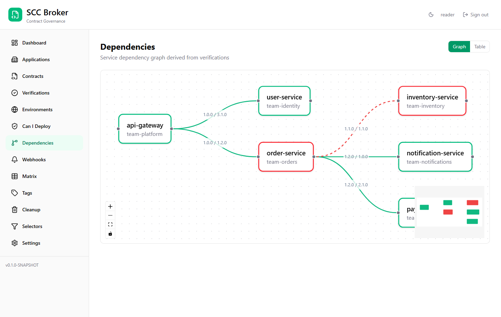
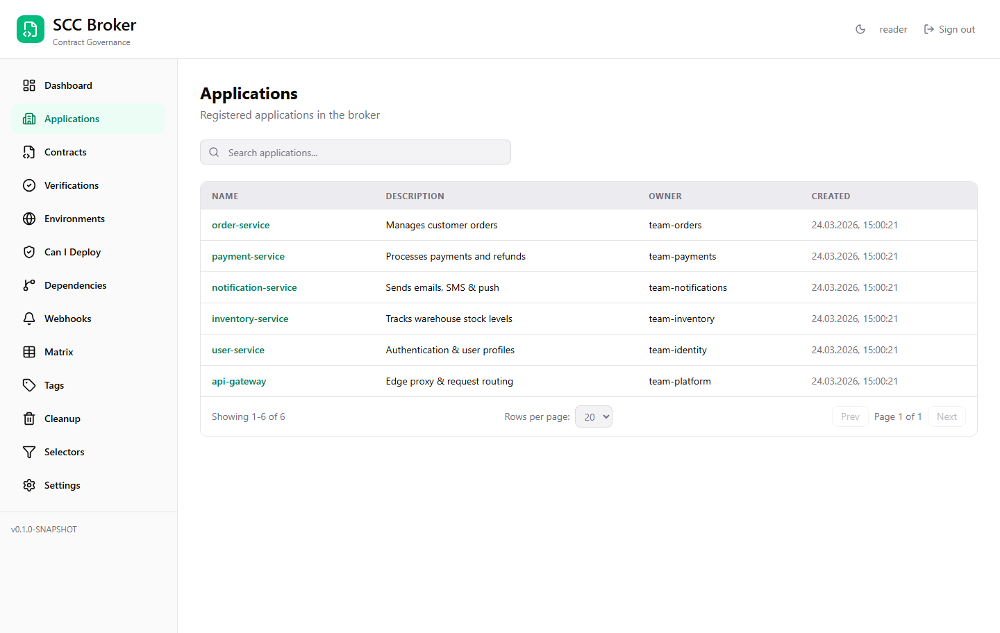
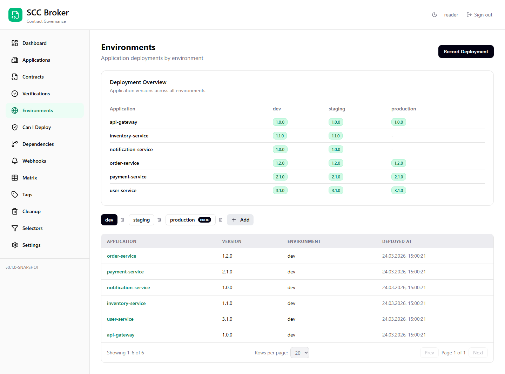
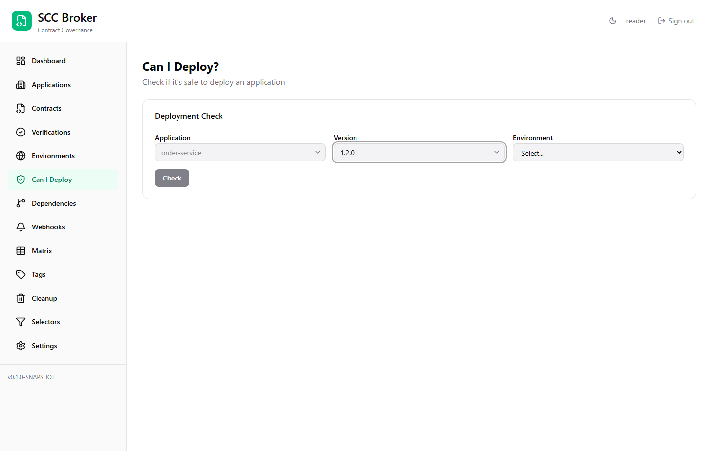
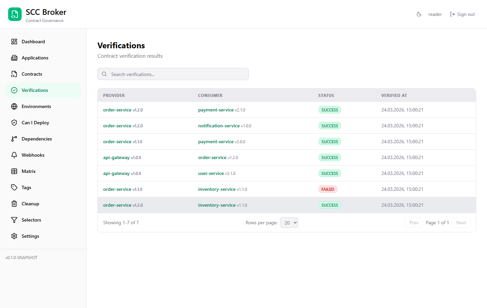
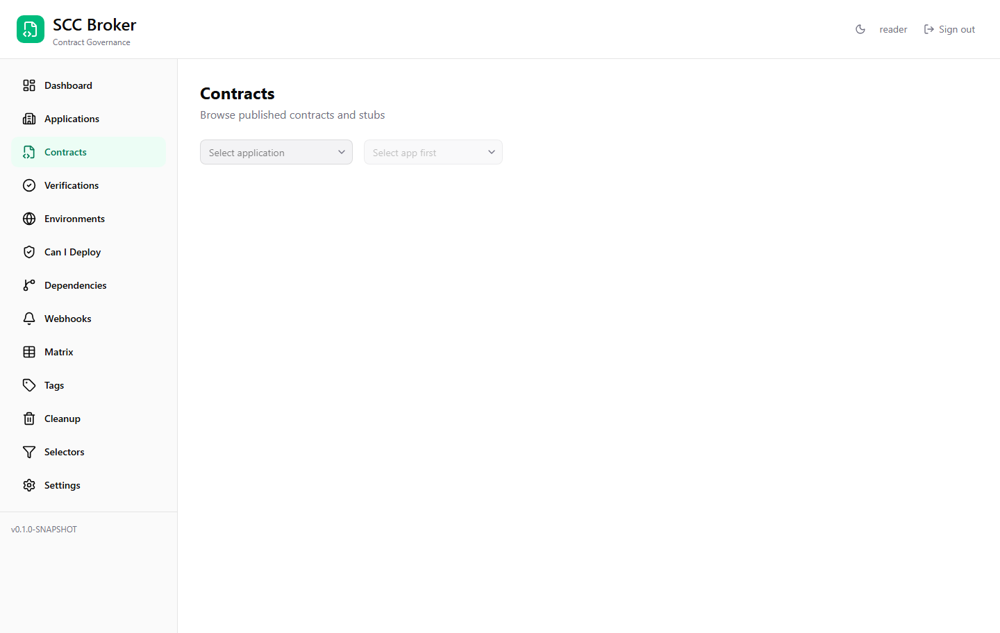
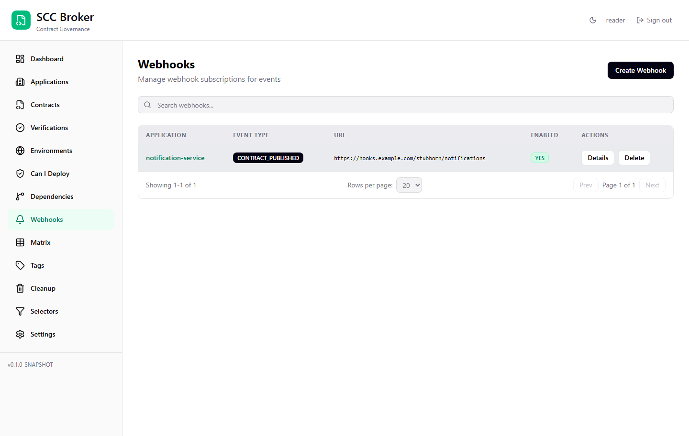
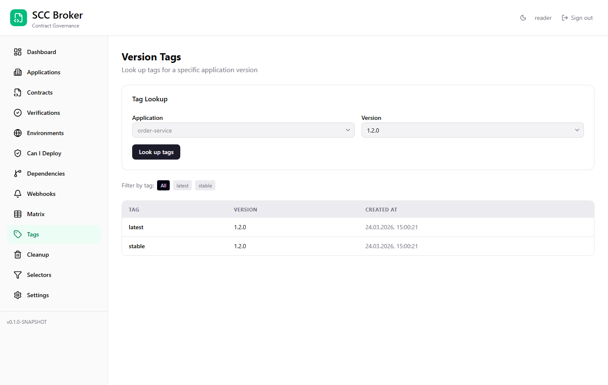

# Stubborn

Branch-aware contract governance for Spring Cloud Contract.

**Your contracts should be stubborn — they don't break just because someone pushed on a Friday.**

Heavily inspired by [Pact Broker](https://github.com/pact-foundation/pact_broker) — the gold standard for contract broker tooling. Stubborn brings the same governance model natively to the Spring Cloud Contract ecosystem.

## Screenshots

| Dashboard | Dependency Graph |
|-----------|-----------------|
|  |  |

| Applications | Environments |
|-------------|-------------|
|  |  |

| Can I Deploy | Verifications |
|-------------|--------------|
|  |  |

| Contracts | Webhooks |
|----------|---------|
|  |  |

| Tags |
|------|
|  |

Try the live demo at [demo.stubborn.sh](https://demo.stubborn.sh).

## License

Apache License 2.0

## Group ID

`sh.stubborn`

## Modules

- `broker/` — Core broker app (REST API, DB, UI static resources, stubs JAR)
- `ui/` — React 19 frontend (Vite + TailwindCSS + React Query)
- `broker-api-client/` — Generated REST client JAR (OpenAPI Generator)
- `broker-stub-downloader/` — StubDownloaderBuilder SPI (sccbroker:// protocol)
- `broker-contract-publisher/` — Core Java library (file scanning, REST calls)
- `broker-maven-plugin/` — Maven Mojo wrapping broker-contract-publisher
- `broker-gradle-plugin/` — Gradle plugin wrapping broker-contract-publisher
- `stub-runner/` — Stub Runner Boot (serves broker stubs for consumer testing)
- `js/` — TypeScript/Node.js SDK (npm packages for cross-language contract testing)
- `build-parent/` — Shared parent POM (dependency mgmt, plugin config)
- `samples/` — Sample apps demonstrating contract testing
- `e2e-tests/` — Playwright browser-based E2E tests
- `docs/` — AsciiDoc documentation
- `charts/` — Helm chart + Kustomize overlays

